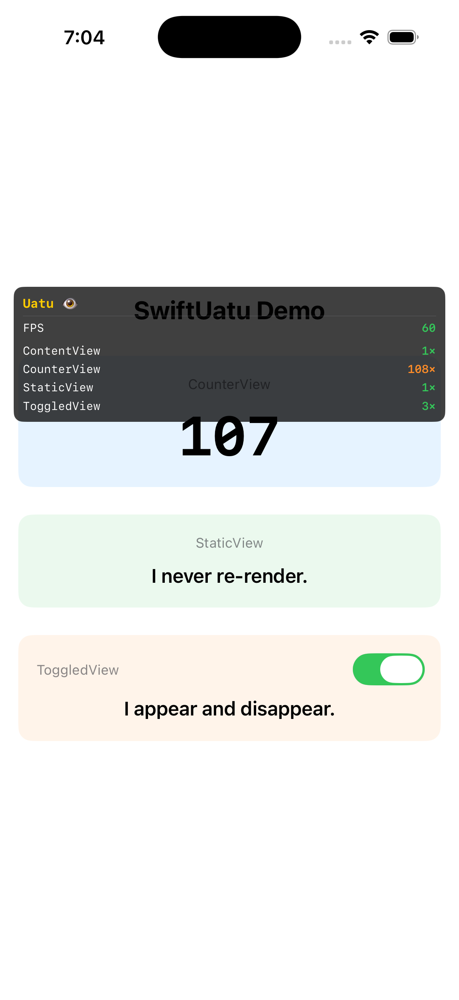

# SwiftUatu

A developer-first observability framework for SwiftUI. SwiftUatu gives you real-time insight into rendering behavior, state propagation, and performance — directly in your running app, with minimal setup.

Inspired by Uatu the Watcher: it observes everything, changes nothing.

---

## Demo



The overlay shows live FPS (green = healthy, orange = degraded, red = critical) alongside per-view render counts. `CounterView` at 108× re-renders reflects its 1-second timer; `StaticView` holds at 1× as expected.

---

## Status

| Milestone | Status |
|---|---|
| v0.1.0 Foundation | ✅ Complete |
| v0.2.0 Runtime Metrics (FPS, Memory, CPU) | ⚪ Not Started |
| v0.3.0 View Diagnostics | ⚪ Not Started |
| v0.4.0 Scroll Diagnostics | ⚪ Not Started |
| v0.5.0 Analysis Engine | ⚪ Not Started |
| v0.6.0 State Analysis | ⚪ Not Started |
| v0.7.0 Re-render Intelligence | ⚪ Not Started |
| v1.0.0 Production Ready | ⚪ Future |

---

## What's in v0.1.0

The full event-driven pipeline is in place:

```
View body
  └─ uatu.trackRender("ViewName")
       └─ EventBus.publish()
            └─ RenderCollector
                 └─ MetricsStore
                      └─ UatuOverlayView (live HUD)
```

Components built:

- **`ProfilerEvent`** — immutable value type representing a single runtime signal (rendered, appeared, disappeared)
- **`EventBus`** — actor-based pub/sub. Instrumentation publishes; collectors subscribe. Neither side knows about the other.
- **`RenderCollector`** — subscribes to the bus, filters `.viewRendered` events, writes counts to MetricsStore
- **`MetricsStore`** — actor-isolated single source of truth for all computed metrics
- **`UatuConfig`** — value-type configuration (enable/disable, overlay visibility, per-view render cap)
- **`Uatu`** — the framework entry point. Owns all components, wires them together, exposes the public API
- **`UatuViewModifier`** — attaches lifecycle tracking (appear/disappear) to any view via `.trackWithUatu(name:eventBus:)`
- **`UatuOverlayView`** — floating HUD that polls MetricsStore every 0.5s and displays live render counts

---

## Usage

**1. Create and start Uatu at the app root:**

```swift
@main
struct MyApp: App {
    @StateObject private var uatu = Uatu()

    var body: some Scene {
        WindowGroup {
            ContentView()
                .environmentObject(uatu)
                .uatuOverlay(uatu: uatu)
                .task { await uatu.start() }
        }
    }
}
```

**2. Track render counts inline inside any view's body:**

```swift
struct FeedView: View {
    @EnvironmentObject var uatu: Uatu

    var body: some View {
        let _ = uatu.trackRender("FeedView")
        // ... rest of body
    }
}
```

**3. Track lifecycle events via the modifier:**

```swift
FeedView()
    .trackWithUatu(name: "FeedView", eventBus: uatu.eventBus)
```

**4. Disable for production builds:**

```swift
let uatu = Uatu(config: UatuConfig(isEnabled: false))
```

---

## Design notes

**Why inline render tracking?**
SwiftUI does not re-call a `ViewModifier`'s `body` when the wrapped view's internal state changes — it skips modifier re-evaluation when inputs are stable. The only reliable hook into a view's body evaluations is from inside the body itself. `let _ = uatu.trackRender("...")` is idiomatic SwiftUI: it evaluates the expression for its side effect and discards the `Void` result.

**Why actors?**
Events can be emitted from many places simultaneously. Actors provide thread-safe access without manual locking. `EventBus`, `MetricsStore`, and `RenderCollector` are all actors.

**Why fire-and-forget Tasks?**
SwiftUI's `body` and lifecycle callbacks are synchronous. `EventBus.publish` is `async`. We bridge them with `Task { await ... }` — safe because `ProfilerEvent` is `Sendable`.

---

## Project structure

```
SwiftUatu/
├── Core/
│   ├── Events/          ProfilerEvent.swift
│   ├── EventBus/        EventBus.swift
│   ├── Collectors/      RenderCollector.swift
│   └── MetricsStore/    MetricsStore.swift
├── Config/              UatuConfig.swift
├── Instrumentation/     UatuViewModifier.swift
├── Overlay/             UatuOverlayView.swift
└── SwiftUatu.swift      Uatu (entry point)

SwiftUatuDemo/           Demo app — three views with different render rates
```
